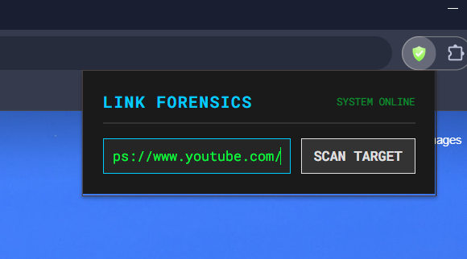
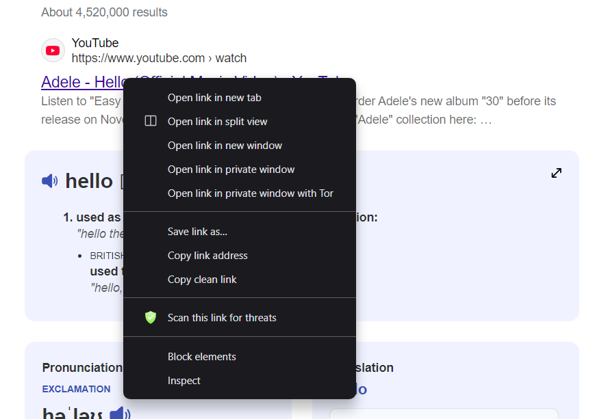
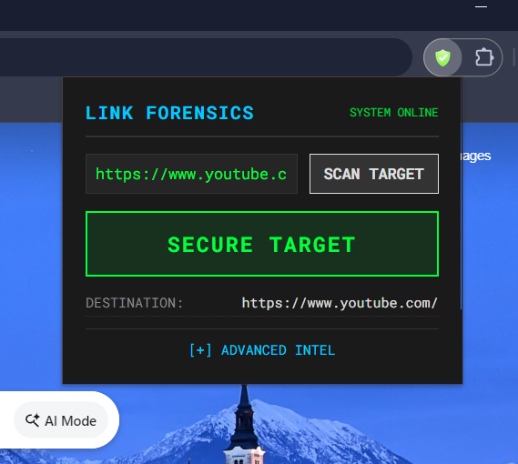
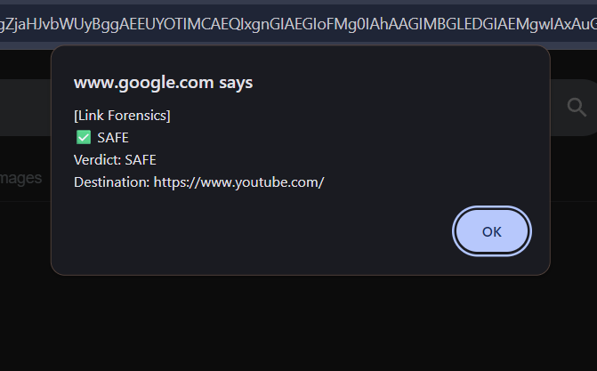
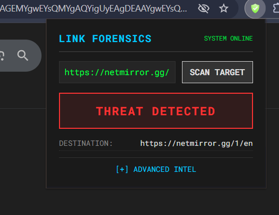
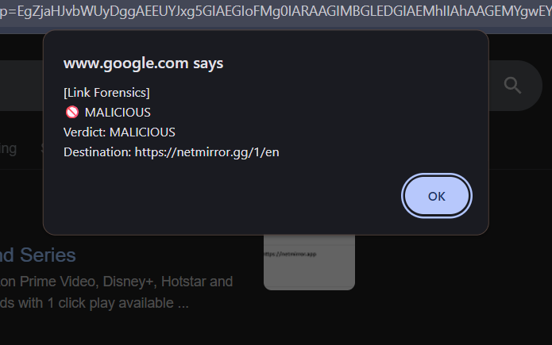

# 🔐 Link Authenticator – Chrome Extension

Link Authenticator is a **Chrome extension** that allows users to verify whether a URL is **safe, suspicious, or malicious** before interacting with it.

It supports both **manual scanning** and **one-click scanning directly from the right-click menu**, making link verification fast and frictionless.

---

## 🚀 Features

* Scan any URL before opening it
* **Right-click on any link → Scan for threats**
* Clear safety verdict (SAFE / MALICIOUS)
* Lightweight and fast
* No user configuration required
* No sensitive data stored in the browser

---

## ⚙️ Technologies Used

### Frontend (Chrome Extension)

* **JavaScript (ES6)**
* **HTML5**
* **CSS3**
* **Chrome Extensions API (Manifest v3)**
* **Chrome Context Menus API**

### Backend (Pre-deployed)

* **Python**
* **Flask**
* **Gunicorn**
* **Docker**
* **Google Cloud Run**
* **VirusTotal API** (Threat Intelligence)

> Backend services are already deployed and managed by the team.
> Users do **not** need to configure or run any backend components.

---

## 🤖 AI-Assisted Development Tools

Modern AI tools were used to accelerate development and improve code quality:

* **Google Gemini** – backend logic design, API structuring, debugging support
* **AntiGravity** – frontend flow optimization and interaction refinement

These tools were used strictly as **development assistants**, with all architectural and integration decisions made by the team.

---

## ⚡ Quick Setup (Chrome)

> **No backend setup required.**

### 1️⃣ Download the Extension Code

```bash
git clone https://github.com/Shivanshsingh0001/link_authenticator
```

Or download and extract the ZIP.

---

### 2️⃣ Open Chrome Extensions Page

Navigate to:

```
chrome://extensions/
```

Enable **Developer mode** (top-right).

---

### 3️⃣ Load the Extension

1. Click **Load unpacked**
2. Select the `extension/` folder
3. The extension will appear in the extensions list

⚠️ Selecting the wrong folder will cause loading to fail.

---

### 4️⃣ Pin the Extension (Optional)

* Click the puzzle icon (🧩)
* Pin **Link Authenticator** for quick access

---

## 🧪 Using the Extension

### Option 1: Scan via Extension Popup

1. Click the **Link Authenticator** icon
2. Paste a URL or scan the current tab
3. Click **Check Link**
4. View the verdict instantly

### Option 2: Scan via Right-Click (Recommended)

1. Right-click on any link on a webpage
2. Select **“Scan this link for threats”**
3. The scan result is fetched and displayed immediately

This allows users to verify links **before clicking them**, reducing phishing and malware risk.

---

## 🖼️ Screenshots

### Extension Popup



### Right-Click Context Menu



### Safe Link Result



### Malicious Link Warning




---

## 🧠 How It Works (Brief)

1. User submits a URL (popup or right-click)
2. The extension sends the URL to a secure backend API
3. Threat intelligence analysis is performed
4. A consolidated safety verdict is returned
5. The result is displayed in the browser UI

No API keys or sensitive credentials are exposed to the client.

---

## 🏁 Summary

Link Authenticator provides a **practical, real-world solution** for preventing phishing and malicious link attacks by enabling users to scan links **before they click them**.

---

